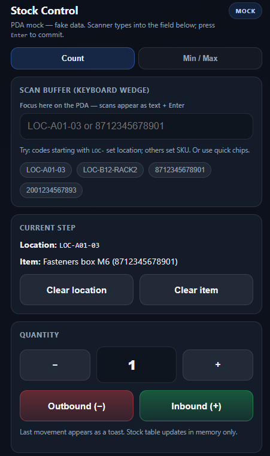

  

# Stock Control — PDA

  

Client-facing proposal and **static UI mock** for a **stock keeping** application aimed at **warehouse PDAs**: scan-driven workflow, **minimum / maximum** stock visibility, and **mobile-first** ergonomics.

**Update (2026-05)**: Proposed delivery is **.NET MAUI**:

- **Admin app**: MAUI (**Android**, optional **Windows desktop**) for compact master-data registration.
- **Operation app (Stock Control PDA)**: MAUI (**Android**) optimized for scan-first warehouse workflows.

## 🧩 Proposed prototype (preview)

This is the **proposed solution prototype** (a reference screen for the customer to review and validate the flow/UX before development):

  

- **Scan-first PDA flow**: designed around a fast, repeatable **Location → Item → Quantity** sequence.
- **Keyboard-wedge friendly**: assumes barcode scans arrive as **typed input + Enter**, so focus and step transitions are predictable.
- **Clear movement actions**: explicit **Inbound (+)** and **Outbound (−)** actions to reduce operator errors.
- **Mobile-first ergonomics**: large touch targets and short forms suitable for small screens (PDA / handheld).
- **Min/Max visibility**: highlights items **below minimum** or **above maximum** to drive replenishment and corrective actions.

---

## 🎯 Customer goals

- **Stock keeping** with clear reporting when quantities fall **below minimum** or rise **above maximum**.
- On the **PDA**, the operator identifies the **stock location** (bin / aisle / slot), then records movements as **“X minus”** (outbound) or **“X plus”** (inbound).
- Devices ship with **2D** (and typically **1D linear**) barcode imagers; in standard **keyboard wedge** mode, scans arrive in the app as **rapid keystrokes** (often terminated by **Enter**).
- Delivery as a **.NET MAUI** app on **Android PDA**, optimized for **small screens** and gloved or stylus use.

---

## ✅ Proposed solution (high level)

| Area | Proposal |
|------|-----------|
| **Architecture** | **MAUI apps** (Admin + Operation) + **API** + database for items, locations, min/max thresholds, and **immutable movement lines** (who, when, where, +/- quantity). |
| **Operator flow** | **1)** Confirm or scan **location** → **2)** Scan **item** (SKU / internal QR / GTIN) → **3)** Enter quantity and tap **Inbound (+)** or **Outbound (−)** → **4)** Optional confirmation / undo window. |
| **Scanner integration** | The app **receives** scan data as keyboard input: focused fields, **suffix Enter** handling, and validation of code lengths / prefixes. No OS-level “injection” is required—the **PDA scanner** sends characters like a keyboard. |
| **Reporting** | Dashboard or list: **below minimum**, **above maximum**, optional “healthy” band; filters by location / category; export (e.g. **Excel / PDF**) for purchasing. |
| **Accounts** | Sign-in and roles (e.g. operator vs supervisor); audit trail on movements. |

---

## 📱 PDA and barcode readers

- Industrial PDAs usually expose the scanner as a **USB HID keyboard** device: each successful read types **text + Enter** into the focused control.
- **2D** symbologies (QR, Data Matrix, etc.) and **1D** barcodes are supported by the hardware; the app treats them as **strings** once they arrive as input events.
- The UI keeps a **predictable focus model** (single “scan receiver” or step-specific fields) so scans never land in the wrong box.

---

## 📊 Minimum / maximum stock reporting

- Per **item** (and optionally per **location**): configured **min** and **max**.
- **Alerts**: items under min (replenishment), over max (picking / transfer), with last movement and current quantity.
- Optional rules: block negative stock, or allow with supervisor override—aligned with customer policy during discovery.

---

## 🚀 Phased delivery (for estimation)

<table>
  <thead>
    <tr>
      <th><nobr>Phase</nobr></th>
      <th><nobr>Scope</nobr></th>
    </tr>
  </thead>
  <tbody>
    <tr>
      <td><nobr><strong>MVP</strong></nobr></td>
      <td><nobr>MAUI Operation app (Android) + MAUI Admin app (Android), API + DB, locations/items/min-max, inbound/outbound movements, stock by location, min/max alerts, scan handling (keyboard wedge + Enter), basic auth.</nobr></td>
    </tr>
    <tr>
      <td><nobr><strong>Phase&nbsp;2</strong></nobr></td>
      <td><nobr>Optional Windows desktop for Admin, offline queue, label printing, ERP or WMS integration, scheduled reports, advanced permissions.</nobr></td>
    </tr>
  </tbody>
</table>

---

## ❓ Discovery questions (before build)

- What **code formats** exist today for **locations** and **items** (prefixes, lengths, symbologies)?
- Does the scanner append **Enter** (or another suffix) after each read?
- Is stock tracked **per location only**, **global per SKU**, or **both**?
- For the database layer, do we **create a new database** for this solution, or **integrate with the customer's existing database / ERP / WMS**?
- Are **batches / lots / expiry** required in the first release?
- Is **offline** on the PDA mandatory, or is online-only acceptable for MVP?

---

## 🖥️ UI mock (HTML)

Open in a browser (fake data for layout and flow validation only):

- `docs/stock-control-pda-mock.html` (reference UX; implementation target is MAUI)

The mock illustrates:

- **Location → item → quantity (+/−)** on a compact, touch-friendly screen.
- A **Min / Max** alert list.
- A **scan buffer** field suitable for **keyboard wedge** testing (type or paste codes; **Enter** completes a scan).

---

**© 2026 AdminSense. All rights reserved.**
