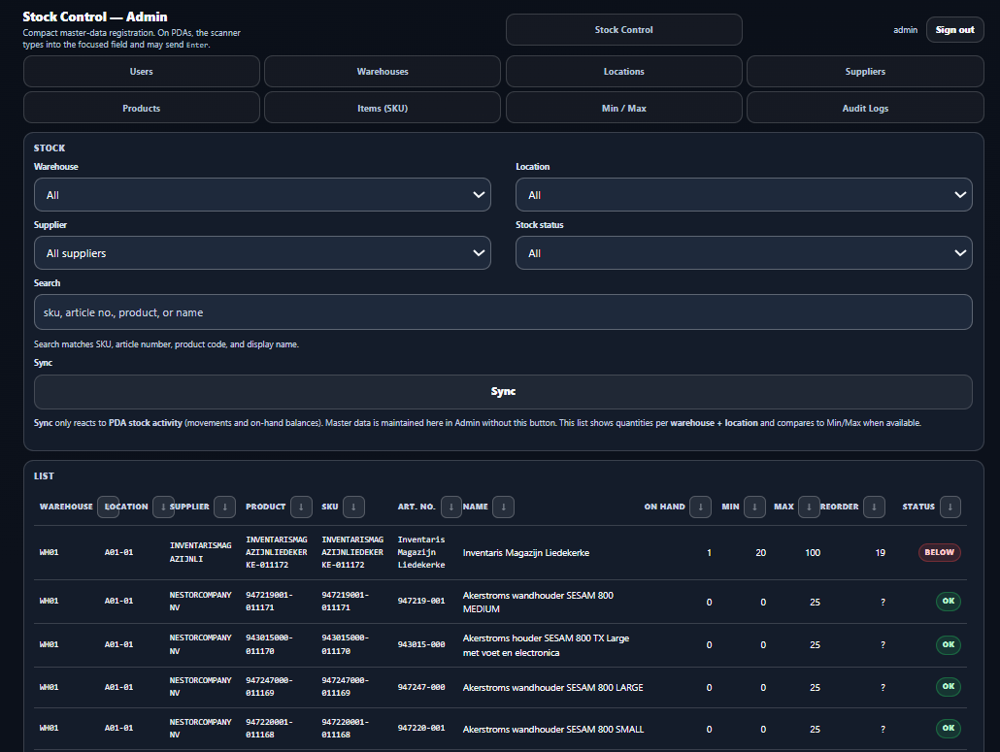
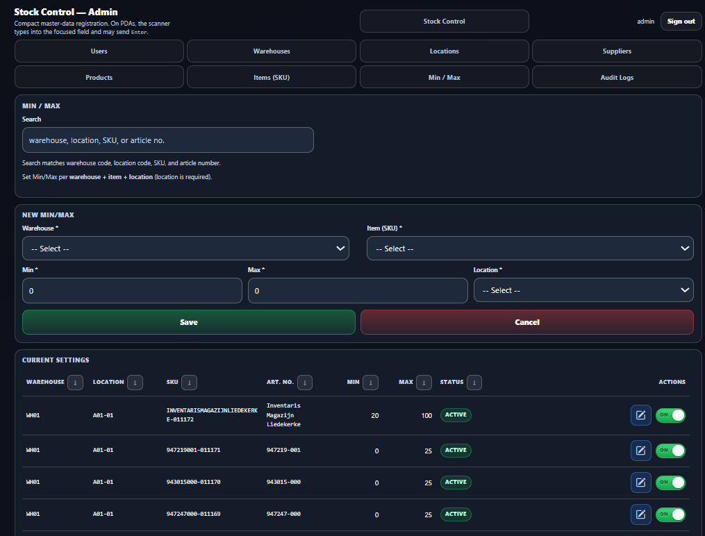

<p align="center">
  
</p>

# Stock Control — Admin (Desktop)


Blazor Server **desktop Admin** used to register master data and view stock balances. The Admin UI is **English** (labels + validation messages).

<p align="center">
  
</p>

*Screenshot (`images/mock_admin_template.png`): **Stock Control** tab — two-row tab bar (8 tabs), **STOCK** filters (Warehouse, Location, Supplier, Stock status, full-width Search and Sync), **LIST** grid with Supplier, Reorder, and Status.*

---

### 📸 Standard master screens (search → form → grid)

<p align="center">
  
</p>

| Piece | Behaviour |
|-------|-----------|
| 🔎 **Search** | Live filter while typing; **hint** under the field lists which columns participate (varies per tab). No decorative search icon — filtering is instant on keystroke. |
| 📝 **Form** | Always visible: empty = **Save** (new row); row selected from grid = **Update** (same fields). **Cancel** clears the form and returns to **Save**. |
| 📊 **Grid** | **Click a row** (active rows only) to load that record into the form. **Inactive** rows: row style + **Edit** disabled — turn **ON** first, then edit. |
| ↕️ **Sort** | Sortable headers (**↓ / ↑**): first click = descending, second = ascending; active column highlighted. **Items** grid uses tighter header typography so labels stay on one line. |
| 🔘 **Active toggle** | **ON** = active in DB; **OFF** = inactive. Inactive records stay in the list but cannot be opened for edit until active again. |
| 💾 **Save / Update** | Single primary action; label switches automatically (`Id == 0` → Save, else Update). |

**Stock** tab (see screenshot above): **Search** uses **SearchField** (SKU, article number, product code, display name). Dropdown filters: **Warehouse**, **Location**, **Supplier**, **Stock status** (all / below min / above max). **Search** and **Sync** span the full filter width (aligned with the two-column rows above).

### 🔎 Search hints (live filter)

| Tab | Text search matches |
|-----|---------------------|
| 👤 **Users** | Username, name |
| 🏭 **Warehouses** | Code, name |
| 📍 **Locations** | Warehouse code, location code, description |
| 🏢 **Suppliers** | Code, name |
| 📦 **Products** | Code, name |
| 🏷️ **Items** | SKU, article number, product code, display name, barcodes |
| ⚖️ **Min / Max** | Warehouse code, location code, SKU, article number |
| 📦 **Stock** | SKU, article number, product code, display name — *plus* **Warehouse**, **Location**, **Supplier**, **Stock status** dropdowns |

---

### 📌 Quick facts

| Topic | Value |
|------|-------|
| 🖥️ **Platform** | Windows desktop |
| 🧱 **App type** | Blazor Server (Admin) |
| 🧭 **Navigation** | 8 tabs (4 + 4 rows) |
| ✅ **CRUD** | Create / Edit / Activate / Deactivate |
| 🔎 **Pagination** | 10 rows per page (Prev/Next) |
| 🧩 **Min/Max** | Dedicated **Min / Max** tab (`/minmax`): targets per warehouse + item + **location** (location required) |
| 📦 **Stock** | On-hand per Warehouse + Location + Item |
| 🌐 **Language** | English (UI + validation messages) |
| 🔐 **Auth** | JWT (Admin: HttpOnly cookie; PDA: Bearer token). Roles **1** = Admin, **2** = Admin PDA |

---

## 🧭 Tabs (8)

- **Users**
- **Warehouses**
- **Locations**
- **Suppliers**
- **Products**
- **Items (SKU)**
- **Min / Max** (`/minmax`)
- **Stock** (`/` and `/stock`)

---

## 🗄️ Database (EF Core)

- Migrations: `src/StockControl.Admin/Migrations/`. Apply via terminal: `dotnet ef database update --project src/StockControl.Admin`.
- To update the database manually from the repo root:

  `dotnet ef database update --project src/StockControl.Admin/StockControl.Admin.csproj --startup-project src/StockControl.Admin/StockControl.Admin.csproj`

---

## ✅ Common UI rules (applies to all pages)

- **Pagination**: 10 rows per page, with **Prev/Next** and “Showing X–Y of Z”.
- **Status**: boolean dropdown (**Active / Inactive**).
- **CRUD**: create/edit + deactivate/activate (no hard delete in the UI).
- **Validations**: user-friendly messages in English; `maxlength` enforced in inputs.
- **Feedback**: messages are shown as a **modal** (theme colors). When it is a validation error, closing the modal focuses the field that needs correction.
- **List sorting**: sortable headers (except **Actions**); first click = **↓** descending (default load is newest-by-`Id`); second click = **↑** ascending; active column highlighted — same behaviour as in the **Standard master screens** table above.

### Stock page — Sync

- **Sync** removes keyboard focus from the button (avoids a “stuck” focus ring), then compares the latest catalog activity on **`items`** (`MAX(UpdatedAt ?? CreatedAt)`) to a baseline taken after the last successful sync (including the first page load).
- If nothing changed: success modal **“Everything is synchronized.”**
- If the catalog changed: a **busy** overlay (spinner) appears briefly while the grid reloads (`stock_balances` + Min/Max resolution); then **“Synchronization completed.”**

### UI — readability

- Form controls use **higher-contrast** backgrounds, borders, placeholders, and `select` / `option` colors in `StockControl.Admin.Client/wwwroot/css/admin-theme.css`, with `color-scheme: dark` for better native dropdown rendering.

---

## 🗃️ Data model (tables + fields)

<table>
  <thead>
    <tr>
      <th align="left">Table</th>
      <th align="left">Fields (key ones)</th>
      <th align="left">Constraints / rules</th>
    </tr>
  </thead>
  <tbody>
    <tr>
      <td><code>users</code></td>
      <td>
        <code>Username</code>, <code>Name</code>, <code>Role</code>, <code>Password</code>, <code>IsActive</code>
      </td>
      <td>
        <ul>
          <li><code>Username</code> required, unique, ≤ 50</li>
          <li><code>Name</code> required, ≤ 50</li>
          <li><code>Role</code> required, <code>int</code> — only codes stored: <strong>1</strong> = Admin (web), <strong>2</strong> = Admin PDA (scanner app)</li>
          <li><code>Password</code> optional in DB until set; stores a <strong>hash</strong> (not plain text), ≤ 500 chars</li>
        </ul>
      </td>
    </tr>
    <tr>
      <td><code>warehouses</code></td>
      <td>
        <code>Code</code>, <code>Name</code>, <code>IsActive</code>
      </td>
      <td>
        <ul>
          <li><code>Code</code> required, unique, ≤ 20 (stored upper-case)</li>
          <li><code>Name</code> required, ≤ 50</li>
        </ul>
      </td>
    </tr>
    <tr>
      <td><code>locations</code></td>
      <td>
        <code>WarehouseId</code>, <code>Code</code>, <code>Description</code>, <code>IsActive</code>
      </td>
      <td>
        <ul>
          <li><code>WarehouseId</code> required</li>
          <li><code>Code</code> required, ≤ 12 (stored upper-case)</li>
          <li>Unique per warehouse: (<code>WarehouseId</code>, <code>Code</code>)</li>
          <li><code>Description</code> optional, ≤ 50</li>
        </ul>
      </td>
    </tr>
    <tr>
      <td><code>suppliers</code></td>
      <td>
        <code>Code</code>, <code>Name</code>, <code>IsActive</code>
      </td>
      <td>
        <ul>
          <li><code>Code</code> required, unique, ≤ 20 (stored upper-case)</li>
          <li><code>Name</code> required, ≤ 100</li>
        </ul>
      </td>
    </tr>
    <tr>
      <td><code>products</code></td>
      <td>
        <code>SupplierId</code>, <code>Code</code>, <code>Name</code>, <code>IsActive</code>
      </td>
      <td>
        <ul>
          <li><code>SupplierId</code> required (FK to <code>suppliers</code>, delete restricted)</li>
          <li><code>Code</code> required, unique, ≤ 40 (stored upper-case)</li>
          <li><code>Name</code> required, ≤ 100</li>
        </ul>
      </td>
    </tr>
    <tr>
      <td><code>items</code></td>
      <td>
        <code>ProductId</code>, <code>Sku</code>, <code>ArticleNumber</code>, <code>DisplayName</code>, <code>Unit</code>, <code>PackagingType</code>, <code>PackageQuantity</code>, <code>Price</code>, <code>Barcodes</code>, <code>IsActive</code>
      </td>
      <td>
        <ul>
          <li><code>ProductId</code> required (FK to <code>products</code>, delete restricted)</li>
          <li><code>Sku</code> required, unique, ≤ 40 (stored upper-case) — internal stock-keeping code</li>
          <li><code>ArticleNumber</code> required in DB (default empty), ≤ 50 — supplier / catalog <strong>Artikelnummer</strong>, distinct from <code>Sku</code></li>
          <li><code>DisplayName</code> required, ≤ 100</li>
          <li><code>Unit</code> required, ≤ 10 (physical unit; <code>stock_balances.QuantityOnHand</code> is expressed in this same unit)</li>
          <li><code>PackagingType</code> stored as <code>int</code> enum: Unit, Box, Case, Pallet, Bag, Kit</li>
          <li><code>PackageQuantity</code> decimal &gt; 0; must be <strong>1</strong> when packaging is <strong>Unit</strong></li>
          <li><code>Price</code> decimal ≥ 0</li>
          <li><code>Barcodes</code> required in DB (default empty); newline-separated list of scanner codes; each non-empty line must be unique across all items (enforced in Admin on save)</li>
        </ul>
      </td>
    </tr>
    <tr>
      <td><code>minmax_settings</code></td>
      <td>
        <code>WarehouseId</code>, <code>ItemId</code>, <code>LocationId</code>, <code>Min</code>, <code>Max</code>, <code>IsActive</code>
      </td>
      <td>
        <ul>
          <li><code>LocationId</code> required (targets are always per physical location)</li>
          <li><code>Min</code> and <code>Max</code> required, ≥ 0</li>
          <li><code>Max ≥ Min</code></li>
          <li>Unique: (<code>WarehouseId</code>, <code>ItemId</code>, <code>LocationId</code>)</li>
        </ul>
      </td>
    </tr>
    <tr>
      <td><code>stock_balances</code></td>
      <td>
        <code>WarehouseId</code>, <code>LocationId</code>, <code>ItemId</code>, <code>QuantityOnHand</code>, <code>IsActive</code>
      </td>
      <td>
        <ul>
          <li>Unique: (<code>WarehouseId</code>, <code>LocationId</code>, <code>ItemId</code>)</li>
          <li>Represents the current on-hand quantity per warehouse + location + item (same unit as the item’s <code>Unit</code>)</li>
        </ul>
      </td>
    </tr>
  </tbody>
</table>

---

## 🪟 Screens (what each tab does)

<table>
  <thead>
    <tr>
      <th align="left">Tab</th>
      <th align="left">What you can do</th>
      <th align="left">Fields</th>
      <th align="left">Rules / validations</th>
    </tr>
  </thead>
  <tbody>
    <tr>
      <td>👥 <strong>Users</strong></td>
      <td>Create / Edit / Activate / Deactivate users; assign role and password for Admin / PDA sign-in</td>
      <td>
        <code>Username</code>, <code>Name</code>, <code>Role</code> (1 or 2), <code>Password</code>, <code>Status</code>
      </td>
      <td>
        <ul>
          <li><code>Username</code> required, unique, ≤ 50</li>
          <li><code>Name</code> required, ≤ 50</li>
          <li><code>Role</code>: <strong>1</strong> = Admin (web only), <strong>2</strong> = Admin PDA (PDA app only)</li>
          <li><code>Password</code> required on <strong>Save</strong> (new user); on <strong>Update</strong>, leave blank to keep the current hash</li>
          <li>Minimum password length: 6 characters</li>
        </ul>
      </td>
    </tr>
    <tr>
      <td>🏭 <strong>Warehouses</strong></td>
      <td>Create / Edit / Activate / Deactivate warehouses</td>
      <td>
        <code>Code</code>, <code>Name</code>, <code>Status</code>
      </td>
      <td>
        <ul>
          <li><code>Code</code> required, unique, ≤ 20 (stored upper-case)</li>
          <li><code>Name</code> required, ≤ 50</li>
        </ul>
      </td>
    </tr>
    <tr>
      <td>📍 <strong>Locations</strong></td>
      <td>Create / Edit / Activate / Deactivate locations per warehouse</td>
      <td>
        <code>Warehouse</code>, <code>Code</code>, <code>Description</code>, <code>Status</code>
      </td>
      <td>
        <ul>
          <li><code>Warehouse</code> required</li>
          <li><code>Code</code> required, ≤ 12 (stored upper-case)</li>
          <li>Unique per warehouse: (<code>WarehouseId</code>, <code>Code</code>)</li>
          <li><code>Description</code> optional, ≤ 50</li>
        </ul>
      </td>
    </tr>
    <tr>
      <td>🏷️ <strong>Suppliers</strong></td>
      <td>Create / Edit / Activate / Deactivate suppliers</td>
      <td>
        <code>Code</code>, <code>Name</code>, <code>Status</code>
      </td>
      <td>
        <ul>
          <li><code>Code</code> required, unique, ≤ 20 (stored upper-case)</li>
          <li><code>Name</code> required, ≤ 100</li>
        </ul>
      </td>
    </tr>
    <tr>
      <td>🧾 <strong>Products</strong></td>
      <td>Create / Edit / Activate / Deactivate products</td>
      <td>
        <code>Supplier</code>, <code>Code</code>, <code>Name</code>, <code>Status</code>
      </td>
      <td>
        <ul>
          <li><code>Supplier</code> required</li>
          <li><code>Code</code> required, unique, ≤ 40 (stored upper-case)</li>
          <li><code>Name</code> required, ≤ 100</li>
        </ul>
      </td>
    </tr>
    <tr>
      <td>🧩 <strong>Items (SKU)</strong></td>
      <td>Create / Edit / Activate / Deactivate items, manage barcodes</td>
      <td>
        <code>Product</code>, <code>Sku</code>, <code>Article number</code>, <code>DisplayName</code>, <code>Unit</code>, <code>Packaging type</code>, <code>Package quantity</code>, <code>Price</code>, <code>Barcodes</code>, <code>Status</code>
      </td>
      <td>
        <ul>
          <li><code>Product</code> required</li>
          <li><code>Sku</code> required, unique, ≤ 40 (stored upper-case)</li>
          <li><code>Article number</code> optional in UI (blank stored as empty string); ≤ 50</li>
          <li><code>DisplayName</code> required, ≤ 100</li>
          <li><code>Unit</code> required, ≤ 10</li>
          <li><code>Package quantity</code> &gt; 0; must be <strong>1</strong> when packaging is <strong>Unit</strong></li>
          <li><code>Price</code> ≥ 0</li>
          <li>Barcodes: one per line; each code must be unique across all items (stored in <code>items.Barcodes</code>)</li>
        </ul>
      </td>
    </tr>
    <tr>
      <td>📊 <strong>Min / Max</strong></td>
      <td>Create / Edit / Activate / Deactivate Min/Max targets per warehouse + item + location</td>
      <td>
        <code>Warehouse</code>, <code>Item</code>, <code>Location</code>, <code>Min</code>, <code>Max</code>, <code>Status</code>
      </td>
      <td>
        <ul>
          <li>Route <code>/minmax</code></li>
          <li><code>Warehouse</code>, <code>Item</code>, and <code>Location</code> required</li>
          <li><code>Min</code>, <code>Max</code> required, ≥ 0 and <code>Max ≥ Min</code></li>
          <li>Uniqueness: one row per (<code>Warehouse</code>+<code>Item</code>+<code>Location</code>)</li>
        </ul>
      </td>
    </tr>
    <tr>
      <td>📦 <strong>Stock</strong></td>
      <td>View on-hand quantities by warehouse + location + item; compare to Min/Max; filter by supplier and stock status</td>
      <td>
        Filters: <code>Warehouse</code>, <code>Location</code>, <code>Supplier</code>, <code>Stock status</code> (all / below min / above max), <code>Search</code> (SKU, article number, product code, display name), <code>Sync</code>
      </td>
      <td>
        <ul>
          <li>Home page: route <code>/</code> (also <code>/stock</code>)</li>
          <li>List columns: Warehouse, Location, Supplier, Product, SKU, Art. no., Name, On hand, Min, Max, <strong>Reorder</strong> (qty to reach min when below), Status</li>
          <li><strong>Sync</strong>: compares latest <code>items</code> activity to last baseline; modal when unchanged; busy overlay + reload when catalog changed</li>
          <li>Min/Max resolve order: location override first, then warehouse default</li>
          <li>Status tag: OK / Below / Above</li>
        </ul>
      </td>
    </tr>
  </tbody>
</table>

---

## Authentication (JWT — Admin + PDA)

Both the **Admin (Blazor Server)** and the **PDA (MAUI)** use the **same JWT** format: one signing key, one issuer/audience, and the same claims. Passwords are never stored in plain text — only a hash in the SQL column `users.Password`.

### Roles (`users.Role`)

| Code | Enum (C#) | Who uses it | Purpose |
|------|-----------|-------------|---------|
| **1** | `UserRole.Admin` | **Admin web** (desktop browser) | Master data, Stock tab, Users management |
| **2** | `UserRole.AdminPda` | **PDA app** (Android) | Move stock, catalog sync, scan workflows |

A user can only sign in where their role matches the app. Example: role **2** cannot open the Admin UI; role **1** cannot sign in on the PDA.

### Configuration (`Jwt` in appsettings)

Copy from `src/StockControl.Admin/appsettings.example.json` into your local `appsettings.json` (not committed — see repo `.gitignore`).

```json
{
  "Jwt": {
    "Key": "change-this-to-a-long-random-secret-at-least-32-chars",
    "Issuer": "StockControl",
    "Audience": "StockControl",
    "ExpiryHours": 12
  }
}
```

| Setting | Description |
|---------|-------------|
| `Key` | Symmetric signing secret (HMAC-SHA256). **Required in production** (Azure App Settings: `Jwt__Key`). Minimum ~32 characters. |
| `Issuer` / `Audience` | Validated on every token (Admin cookie and PDA Bearer). |
| `ExpiryHours` | Token lifetime (default **12**). After expiry, sign in again. |

In **Development**, if `Jwt:Key` is missing, a dev-only default is used (do not rely on this in production).

### How sign-in works

#### Admin (web)

1. Opening any Admin route without a valid JWT shows a **login modal** (`Shared/LoginModal.razor`) — username + password.
2. Credentials are checked against `users` where `IsActive = 1` and **`Role = 1`**.
3. On success, the server issues a JWT via `JwtTokenService` and stores it in an **HttpOnly cookie** named `StockControl.Jwt` (not accessible to JavaScript).
4. Each HTTP request (including the Blazor circuit) is authenticated with **JWT Bearer** middleware, which reads the token from that cookie.
5. **Sign out** (header) deletes the cookie and clears the session.
6. All Admin pages require role claim **`Admin`** (`FallbackPolicy` in `Auth/AuthServiceExtensions.cs`).

Admin UI login calls `POST /api/auth/login?app=admin` from the browser (`stockcontrol.js`), which sets the HttpOnly JWT cookie. The token format is the **same** as the Bearer token returned for PDA.

#### PDA (Android MAUI)

1. On launch, `AppShell` sends the user to **Login** or **Move stock** depending on whether a token exists in **SecureStorage**.
2. Login screen (`LoginPage`) calls **`POST /api/auth/login?app=pda`** with JSON `{ "username", "password" }`.
3. Server validates **`Role = 2`** (`AdminPda`). Response: `{ "ok", "token", "displayName", "error" }`.
4. The app saves the JWT and display name in SecureStorage (`Services/AuthSession.cs`).
5. All API `HttpClient` calls attach `Authorization: Bearer <token>` via `AuthTokenHandler`.
6. **Sign out** on the Move stock screen clears storage and returns to Login.

### Login API (shared by PDA; same token builder as Admin)

| Method | Route | Query | Role required |
|--------|-------|-------|----------------|
| `POST` | `/api/auth/login` | `app=pda` | **2** (Admin PDA) |
| `POST` | `/api/auth/login` | *(omit or any value ≠ `pda`)* | **1** (Admin) |

Example (PDA):

```http
POST /api/auth/login?app=pda
Content-Type: application/json

{"username":"scanner1","password":"YourPassword"}
```

Success (`200`):

```json
{"ok":true,"token":"<JWT>","displayName":"Scanner One","error":null}
```

Failure (`401`):

```json
{"ok":false,"token":null,"displayName":null,"error":"Invalid username or password."}
```

### Protected API endpoints (PDA only)

These require a valid JWT with role **`AdminPda`** (`PdaOnly` policy):

| Area | Routes |
|------|--------|
| Stock movements | `POST /api/stock/movements` |
| Catalog sync | `GET /api/stock/sync` |
| PDA catalog | `GET /api/pda/catalog/warehouses`, `.../locations`, `.../items`, `.../summary` |

The movement API sets **`UserId`** from the JWT (`NameIdentifier` / `uid` claim), not from the request body — each scan is tied to the signed-in user.

### JWT claims (inside the token)

| Claim | Meaning |
|-------|---------|
| `NameIdentifier` / `uid` | `users.Id` |
| `Name` | `users.Username` |
| `display_name` | `users.Name` |
| `role` | `Admin` or `AdminPda` (matches app access) |

Implementation: `Auth/UserAuthService.cs` (`CreatePrincipal`), `Auth/JwtTokenService.cs` (`CreateToken`).

### Database migration

Migration **`AddUserRoleAndPassword`** adds:

- `users.Role` (`int`, NOT NULL, default **2** for existing rows)
- `users.Password` (`nvarchar(500)`, nullable until set)

Apply manually: `dotnet ef database update --project src/StockControl.Admin`.

### Test passwords (database seed)

Passwords are set in SQL only (migration `FixSeedUserPasswordsByUsername` or [`scripts/seed-user-passwords.sql`](../scripts/seed-user-passwords.sql)). See **[LOGIN-TEST-USERS.md](LOGIN-TEST-USERS.md)** for usernames **admin**, **pda** and password `Pda2!Stock`. The app does not create passwords on startup.

For new users, use the **Users** tab: pick role **1** or **2**, set password on **Save**.

### Security notes (small team / ~3 users)

- Always use **HTTPS** in production (Azure); the Admin JWT cookie is marked **Secure** when the request is HTTPS.
- JWT avoids sending the password on every API call (only at login).
- Same `Jwt:Key` on the server that hosts Admin + API; PDA only needs `Api:BaseUrl` pointing at that host.
- Do not commit `appsettings.json` with real secrets; use Azure Application Settings or user secrets locally.

### Code locations

| Topic | Path |
|-------|------|
| Entity + enum | `src/StockControl.Admin/Data/Entities.cs` (`UserRole`, `AppUser`) |
| EF mapping | `src/StockControl.Admin/Data/AppDbContext.cs` |
| JWT config + policies | `src/StockControl.Admin/Auth/AuthServiceExtensions.cs` |
| Token create/validate | `src/StockControl.Admin/Auth/JwtTokenService.cs` |
| Admin sign-in / sign-out | `src/StockControl.Admin/wwwroot/js/stockcontrol.js`, `Api/AuthApi.cs` |
| Login API | `src/StockControl.Admin/Api/AuthApi.cs` |
| Admin login UI | `src/StockControl.Admin/Shared/LoginModal.razor` |
| PDA login UI | `src/StockControl.PDA/LoginPage.xaml` |
| PDA session + Bearer | `src/StockControl.PDA/Services/AuthSession.cs`, `AuthTokenHandler.cs`, `AuthApiClient.cs` |
| Example config | `src/StockControl.Admin/appsettings.example.json` |

---

## Documentation

- 🏠 [Main Documentation](../README.md) - Project overview

---

**© 2026 AdminSense. All rights reserved.**

