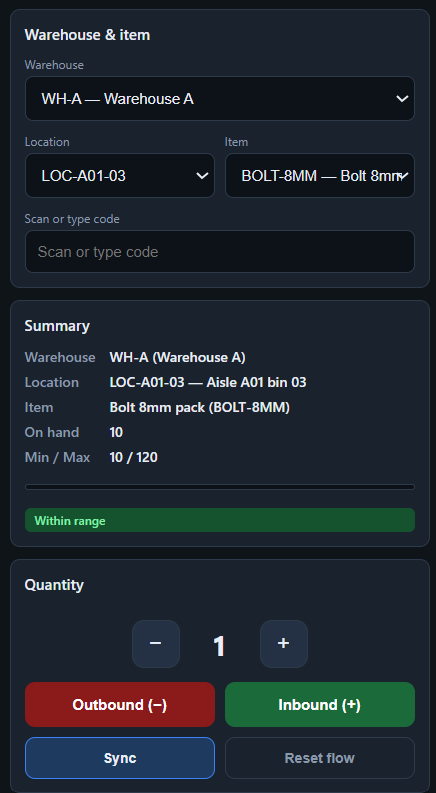

  

# 📦 Operation (Stock Control) — MAUI Android (PDA)

Scan-driven **operation app** built with **.NET MAUI for Android** for fast warehouse stock movements on PDAs.

---

### 📌 Quick facts

| Topic | Value |
|------|-------|
| **Platform** | Android PDA |
| **Workflow** | **Move stock** follows the mock [`pda-move-stock.html`](../docs/pda-move-stock.html): pickers, scan, Summary, quantity, In/Out, **Sync** \| **Reset** — see **section 4**. |
| **Scanner** | Keyboard wedge (text + Enter) |
| **Connectivity** | Online (MVP) |
| **MAUI targets** | **Android only** — `Platforms/Android` only (`net10.0-android`, min API 21). iOS / Windows / Mac Catalyst folders are not in this repo. |

## ✅ 1. Goals (MVP)

- Register stock movements with a fast, repeatable flow: **Location → Item → Quantity → Inbound (+) / Outbound (−)**.
- Show **min/max** and simple alerts (below min / above max).
- **Online** operation (no offline in the MVP).

## 📋 2. Admin vs warehouse floor — what Admin does *not* know automatically

Admin holds **master data** and **posted transactions**. It does **not** magically reflect physical bins until someone records stock (movements, opening balances, or future cycle counts).

| Situation | Who creates the record | PDA / API today |
|-----------|------------------------|-----------------|
| **Which SKUs are physically in a bin** | Unknown until **stock events** are posted | Admin has no live “bin contents” view unless `stock_balances` / movements exist for that **warehouse + location + item**. |
| **New catalog item** (SKU / barcodes) | **Admin** (`items`) only | PDA **cannot** create items. **Inbound** fails until the item exists and is active. |
| **Known item**, first time in a **new bin** | **PDA Inbound** or **Admin** opening stock | `POST /api/stock/movements` **IN** **creates** `stock_balances` when no row exists yet for that triple. |
| **Unknown barcode** on the floor | — | Not bookable **until** Admin registers the item (or a future “request new item” workflow exists). |

**New empty location:** the **location** exists after Admin saves it. **Balances** appear after the first **IN** (or Admin opening qty). Operators use **Sync** (and future catalog reload) so pickers refresh; **scanning the location code** still works on each movement POST even before pickers exist.

## 🔫 3. Scanner assumptions (keyboard wedge)

- Scanner types into the focused field.
- Scanner can send **Enter** at the end of each scan.
- **Location codes** are **up to 12 characters**.

## 🎨 4. Move stock — UI mock & MAUI behaviour

  

| Area (mock) | Intended behaviour |
|----------------|-------------------|
| 🏭 **Warehouse** / 📍 **Location** / 🏷️ **Item** | **Pickers.** How the **item** list is filtered is a **product/API choice** (rules **A–E**, **section 6**). **Scan** (Enter) should still set location or item when the code matches. |
| ⌨️ **Scan or type code** | Keyboard wedge + **Enter** resolves a **location code** or **item** (SKU / barcode / article number per API rules — **section 5**). |
| 📊 **Summary** | **Warehouse**, **location**, **item**, **on hand**, **min/max**, status pill — server lookups (`/api/pda/catalog/summary`). |
| 🔢 **Quantity** | Stepper **− / +** then **Inbound (+)** / **Outbound (−)**. |
| 🔄 **Sync** \| **Reset flow** | Same row. **Sync** → `GET /api/stock/sync` (MVP: counts + connectivity); after success, **reload catalog pickers** from `/api/pda/catalog/...`. **Reset** clears selection + quantity (mock + MAUI). |

### Planned screens (not in this MVP build)

| Screen | Role |
|--------|------|
| **Login** | Authenticate operator (future). |
| **Min/Max alerts** | List below min / above max with filters (planned). |
| **Quick lookup** | Balance by item/location (planned). |

## 🔁 5. Scan-first flow

1. **Scan location**
   - Validate size (≤ 12) and existence/active status.
2. **Scan item**
   - Accept any barcode line stored on the item (`items.Barcodes`, newline-separated).
3. **Enter quantity**
   - Default = 1; numeric keypad; minimal validation.
4. **Confirm action**
   - Inbound (+) writes `stock_movements(IN)`; Outbound (−) writes `stock_movements(OUT)`.
   - Update `stock_balances` (or receive updated balance from the API).

> **Tip:** if the wrong location/item is selected, use **Reset flow** on **Move stock** before scanning again.

## ✅ 6. Rules & validations (MVP)

- **Location**: code ≤ 12; must exist and be active.
- **Item**: scanned or typed code must match an active item (typically **SKU** or a **barcode** from `items.Barcodes`; **article number** is maintained in Admin for catalog alignment, not necessarily what the scanner sends).
- **Quantity**: > 0.
- **Negative stock**: business decision in MVP
  - Option A: block `OUT` if balance is insufficient
  - Option B: allow negative and flag in reports
- **Audit**: every movement records `user_id`, timestamp, location, and item.

### 📋 Item dropdown (warehouse + location) — which items to list?

| Topic | Details |
|--------|---------|
| **Picker list (MVP)** | **`GET /api/pda/catalog/items`** returns **all active items** → **rule C** in the table below. Warehouse + location on the PDA only define **where** the movement posts. |
| **Still open (product)** | Narrow or replace the list with **A**, **B**, **D**, or **E** via a dedicated API (e.g. `items-for-location`); do not fork conflicting rules only in the client. |

| # | Rule | Meaning |
|---|------|--------|
| **A** | Row in `stock_balances` | Only items that already have a balance row for the selected **warehouse + location** (includes **quantity = 0**). |
| **B** | On hand **> 0** | Same as **A**, but exclude items with `QuantityOnHand <= 0`. Stronger for picking; blocks first inbound unless combined with another path. |
| **C** | All active items | Full **catalog** at the picker; warehouse/location only define **where** the movement posts. Longer lists; simplest query. |
| **D** | `minmax_settings` present | Only items with a min/max row for that **warehouse + location** (replenishment-style shortlist). |
| **E** | **Hybrid** | e.g. list **A** or **B** by default, but **always accept** an item resolved by **scan** even if it would not appear in the dropdown. |

**Implementation:** one explicit endpoint or query (e.g. items-for-location) should implement the chosen row(s) above; avoid duplicating conflicting logic in the app only.

## 🔌 7. Data consumed/sent (API)

- **Read**
  - `GET /api/stock/sync` — PDA **Sync** (MVP: returns counts of warehouses, active locations, active items; future: drive full catalog cache).
  - `warehouses`, `locations`, `items` (including `Barcodes`), `minmax_settings` (or equivalent API surface for min/max)
  - `stock_balances` (for lookup/alerts)
- **Write**
  - `stock_movements` (immutable lines)

### 🔄 Staying in sync with Admin (new locations, empty bins)

#### The issue

| Topic | Details |
|--------|---------|
| **What changes in Admin** | **Warehouses**, **locations**, **items**, and **balances** evolve over time. |
| **Risk on the PDA** | Stale pickers or wrong assumptions about what is in a bin. |
| **Related concept** | Catalog vs physical stock — see **section 2** of this document. |

#### Ways to keep the PDA fresh

| Approach | Role |
|----------|------|
| **Reload on open / filter change** | When the operator opens **Move stock** or changes **warehouse** (and optionally **location**), call the API again for locations, items, balances. |
| **Manual Sync** | **Sync** next to **Reset** explicitly refreshes (MVP: `GET /api/stock/sync` counts); later full catalog cache. **Not** the same as Admin **Stock Control → Sync**. |
| **Background refresh** | Optional; mind battery and server load. |

#### What **Sync** does today (MVP)

| Topic | Details |
|--------|---------|
| **Where** | **Move stock** — **Sync** and **Reset flow** on the same row. |
| **HTTP** | **`GET /api/stock/sync`** |
| **Response (today)** | Counts: warehouses, active locations, active items. |
| **Roadmap** | Reload cached masters for the pickers (see **section 4** mock). |

#### New location, still empty

| Topic | Details |
|--------|---------|
| **Meaning** | The **location** exists in Admin. **No** `stock_balances` row until something posts stock. |
| **Ways a balance appears** | First **IN** on the PDA **or** opening quantity entered in **Admin**. |
| **Cross‑refs** | **Section 2** (Admin vs floor) and **section 5** (scan / confirm flow). |

#### Two valid ways to run day‑to‑day

These are both **correct**; which you prefer depends on whether the item list is driven by **`stock_balances`** (rules **A** / **B** in **section 6**) or by full catalog (**C**), etc.

##### Path 1 — Admin sets opening quantity, PDA adjusts

| Step | Who / what |
|------|------------|
| **1** | **Admin** registers the **item** (and related master data). |
| **2** | **Admin** posts an **opening quantity** at that **warehouse + location** (e.g. **1**). A row exists in **`stock_balances`**. |
| **3** | Operator uses **Sync** / reload on the **PDA** so lists and summaries reflect the server. |
| **4** | Operator **counts** or **adjusts** using **Inbound (+)** / **Outbound (−)** movements. |

**When this fits best:** item picker rules **A** or **B**, because the dropdown is naturally driven by **`stock_balances`**.

##### Path 2 — First putaway on the PDA (no Admin qty first)

| Step | Who / what |
|------|------------|
| **1** | **Location** and **item** exist in Admin. **No** balance row yet for that triple. |
| **2** | First **Inbound (+)** on the **PDA** creates **`stock_balances`** (if the API behaves that way — see product rules). |
| **3** | Later movements adjust the same bin. |

**When this fits best:** you rely on **first IN** to “open” the bin; you may skip entering opening qty in Admin entirely.

| Path | Picker hint |
|------|----------------|
| **Path 1** | Rules **A** / **B** align well: the item already appears because **`stock_balances`** has a row. |
| **Path 2** | Rule **C** (full catalog) or **hybrid E** helps until a balance exists; first **IN** then enables balance‑driven lists if you switch to **A** / **B** later. |

---

## ✋ 8. PDA UX notes

- **Sync**: operator taps **Sync** after Admin changes masters (or periodically). Calls `GET /api/stock/sync`; on success the app **reloads catalog pickers** from `/api/pda/catalog/...` (MVP).
- **Predictable focus**: keep wedge input on **Scan** when possible; **Enter** resolves the code into the pickers (**section 4**).
- **Immediate feedback**: beep/visual on recognized location and item; clear error on unknown codes.
- **Minimal taps**: ideally only tap quantity and the (+/−) button.

---

## Documentation

- 🏠 [Main Documentation](../README.md) — Project overview

---

**© 2026 AdminSense. All rights reserved.**

